<h1>Rabbit Store</h1>

<a target="_blank" href="https://tryhackme.com/room/rabbitstore">Challenge on TryHackMe</a>

    
    

        Demonstrate your web application testing skills and the basics of Linux to escalate your privileges.
    

---

  

I started port discovery with a quick SYN scan using Nmap.  

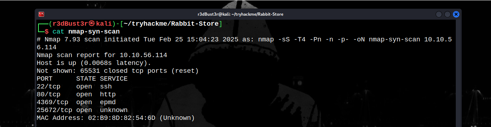  

It appears that 4 ports are open. Now, I need to perform a version scan to identify the services running on the target and their versions.  

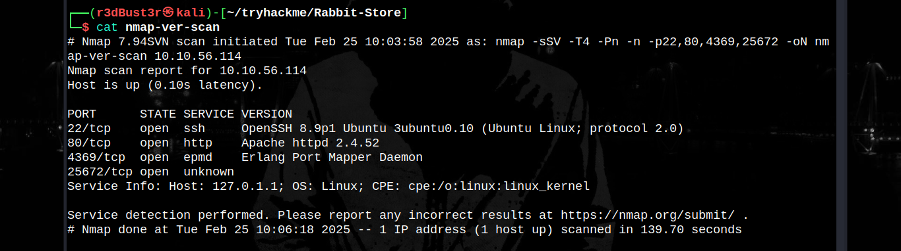  

The website provides a cloud storage service.  
After checking the web service, I noticed that it redirects to a custom domain: `cloudsite.thm`.  

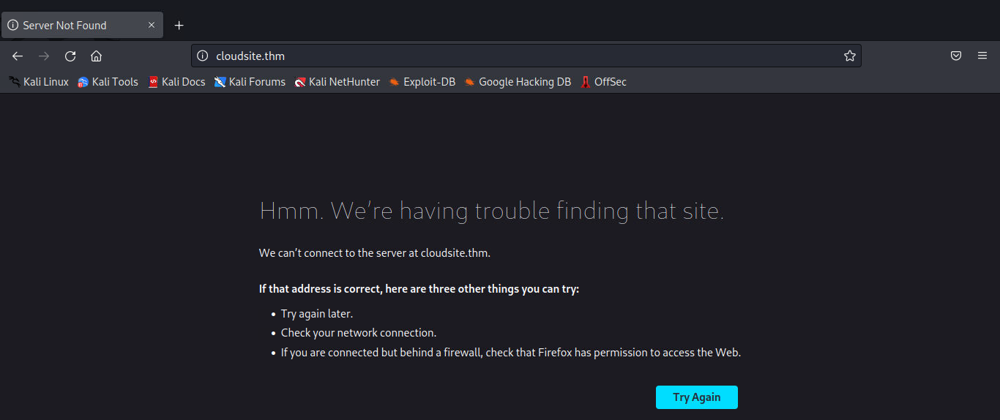  

So, I added it to my `/etc/hosts` file.  

After some navigation on the website, I found a button that redirects to a subdomain: `storage.cloudsite.thm`.  

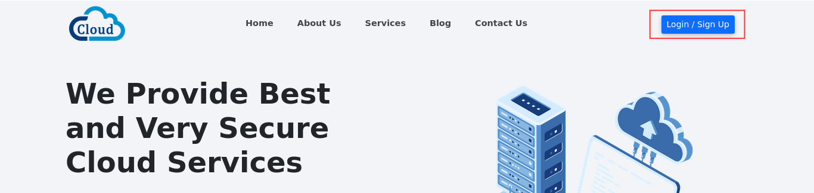  

I added it to the `/etc/hosts` file.  

Then, I found a login/signup form. I created an account, but I couldn’t do anything with it.  

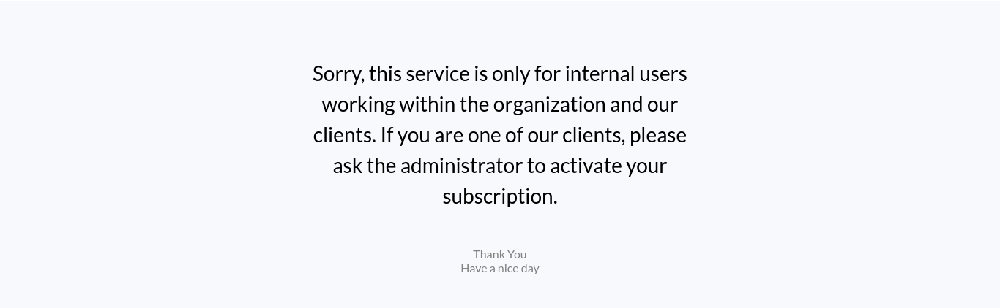  

I checked the authentication token and found a JSON Web Token (JWT). I attempted various attacks, such as modifying the algorithm, downgrading it, removing the signature, and brute-forcing it, but none of them worked.  

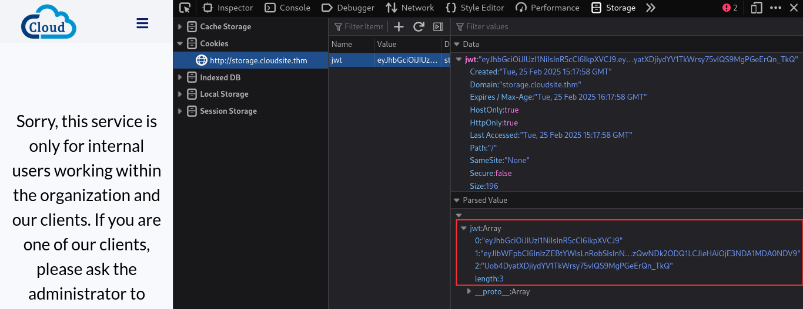  
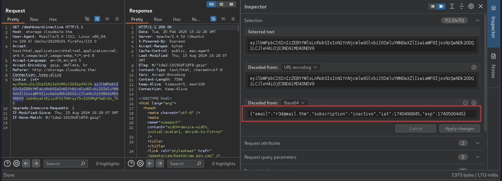  

Next, I tried a different method: **Mass Assignment** and it worked!  
I was able to activate my account during the registration process.  

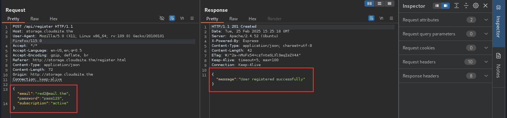  
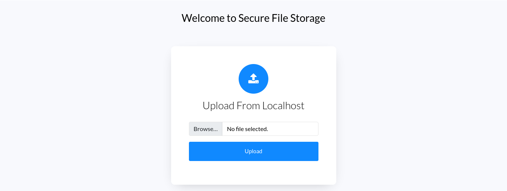  

Now, I could use the file upload functionality.  

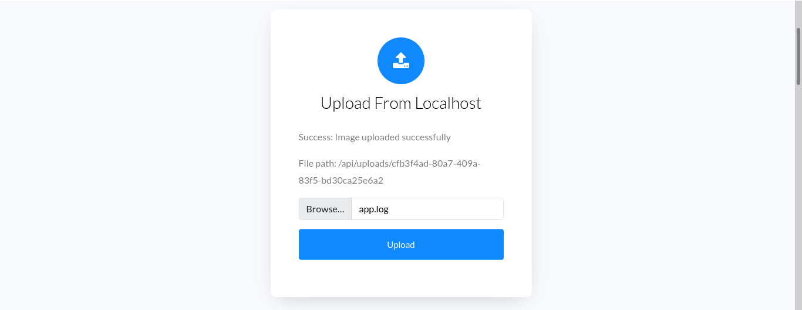  

Here’s what it looked like when I uploaded a file. The server renamed my file with a random name, removing the extension. I could access its content at `/api/uploads/<new-file-name>`.  

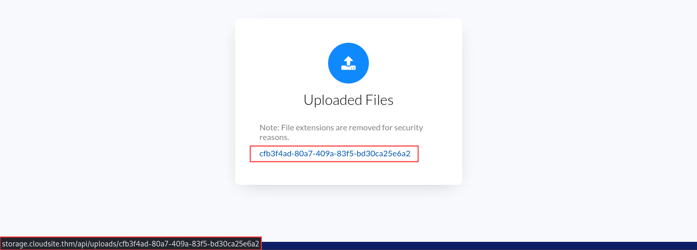  

Then, I launched fuzzing on the `/api/` endpoint.  

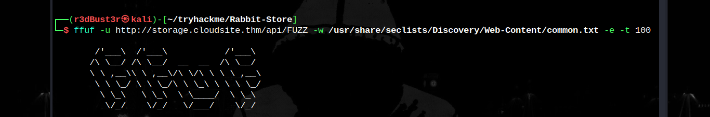  

`common.txt` found 4 endpoints.  

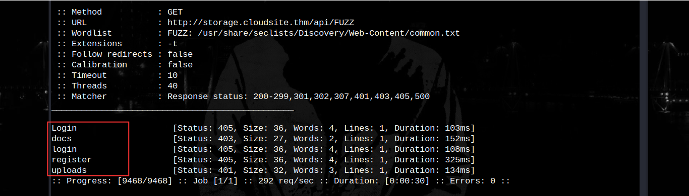  

I tried accessing `docs` with and without my JWT access token, but both attempts resulted in *"Access denied."*  

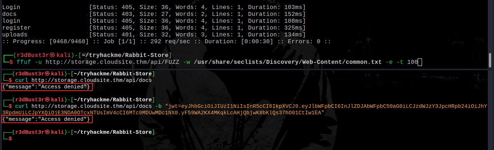  

However, the `uploads` endpoint behaved differently. Without a token, it responded with *"Token not provided."*  
With a token, it returned a list of uploaded files.  

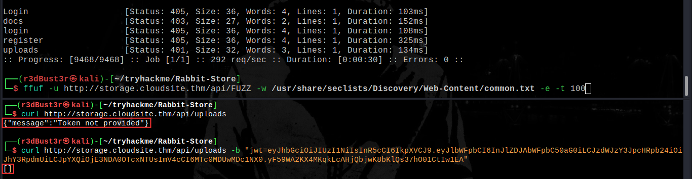  
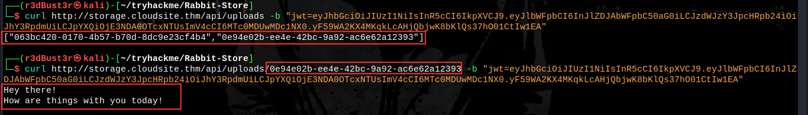  

The website also offers a feature that allows file uploads via URLs.  
I set up a simple HTTP server and tested it. Everything worked as expected.  

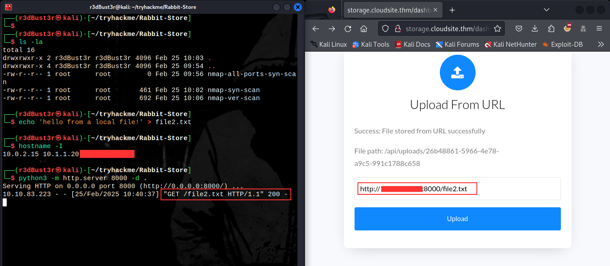  

I intercepted the request with Burp Suite and modified it to point to the server’s `localhost`, hoping to retrieve the contents of the `docs` endpoint.  

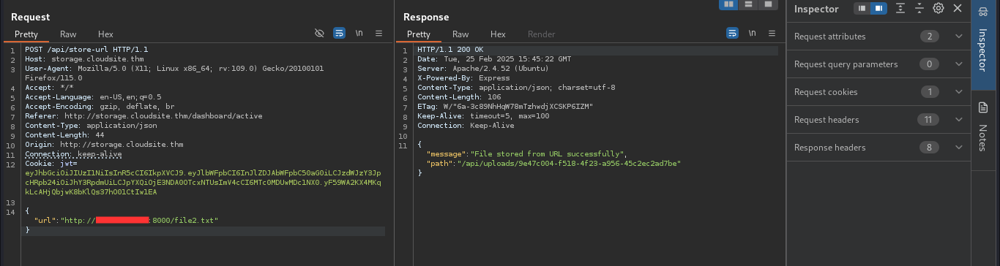  
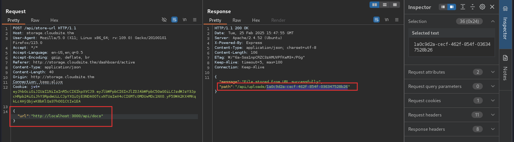  

Then, I requested the newly uploaded file by its name.  

**Booyah!!!**  
I could now access the documentation content.  

---

There was another API endpoint under development: `fetch_messages_from_chatbot`, which accepted `POST` requests.  

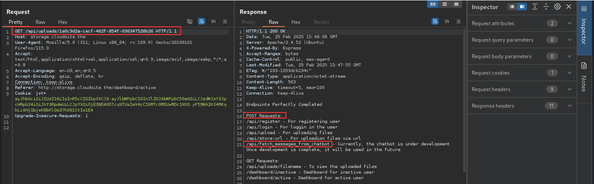  

First, I sent an empty JSON request and received an error message.  

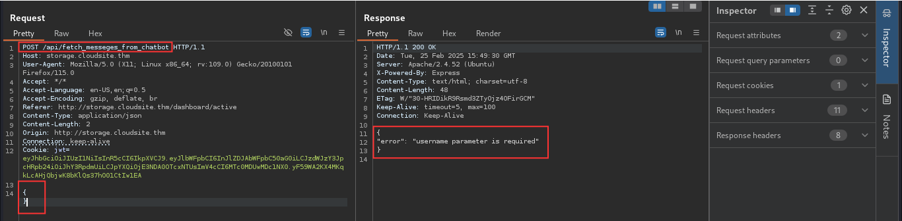  

Then, I sent another request with a `username` parameter. I noticed that usernames were reflected in the response, which suggested a potential injection vulnerability.  

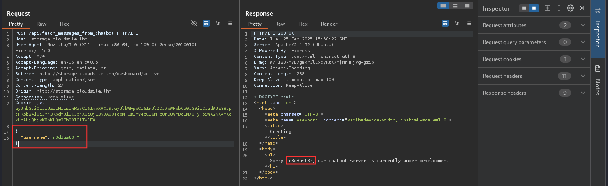  

After testing different injections, I found that the endpoint was vulnerable to **Server-Side Template Injection (SSTI)**.  

The template engine appeared to be Python’s `Jinja`.  

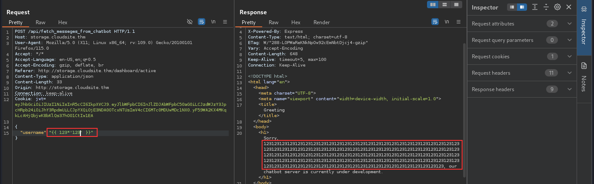  

I injected a reverse shell payload, which successfully connected back to my attacking machine.  

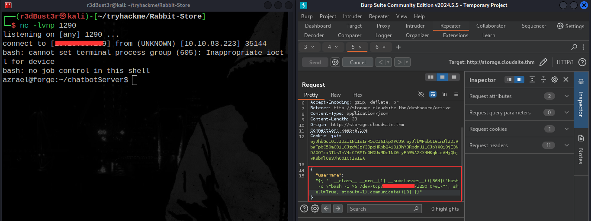  

I stabilized my shell.  

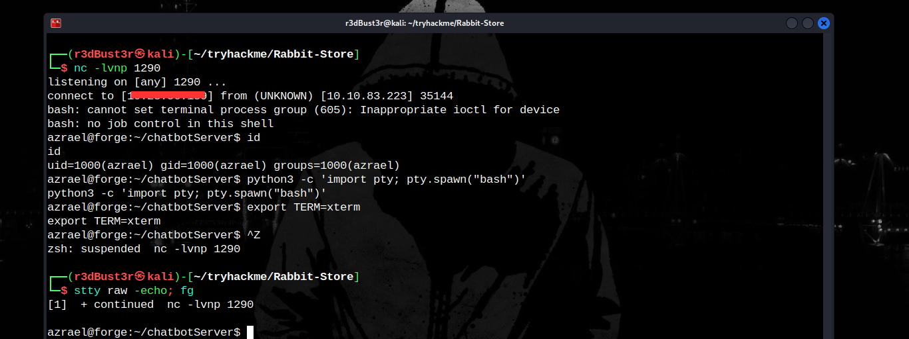  

And I got the user's flag.  

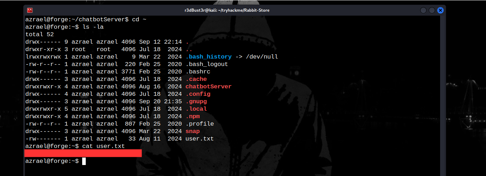  

---

During the enumeration stage, I found that the server was running a service called **Erlang Port Mapper**.  
To interact with it, I needed an **access cookie**.  

I found two files:  
1. generate_erlang_cookie.sh (owned by **root**), which generates the cookie content.  
2. The actual cookie file (owned by **rabbitmq**), which was readable by all users.  

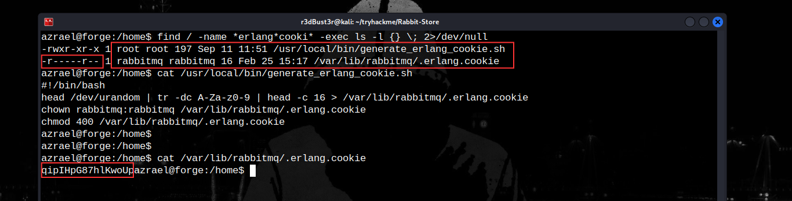  

I used this cookie to interact with the Erlang node.  

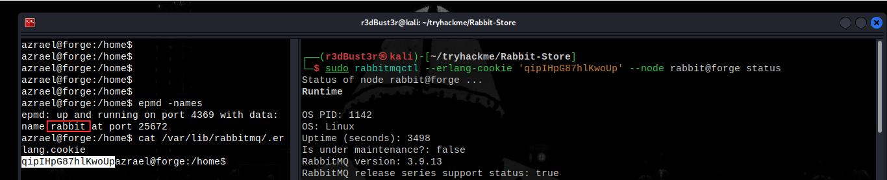  
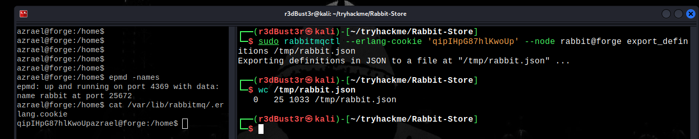  

Finally, I got the root hash.  

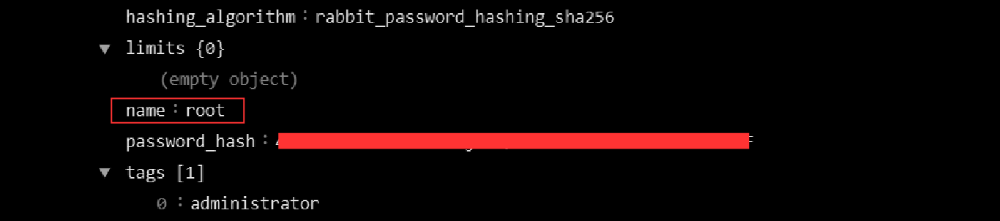  

---

For the final step (I forgot to take a screenshot):  
The hash included a salt (8 characters) and was encoded in Base64.  
To retrieve the actual root password, I had to reverse the encoding process:  

1. Decode it from Base64.  
2. Convert it to hexadecimal.  
3. Remove the first 8 characters (salt).
4. The result was the root password.  

At first, I attempted to crack it with **John the Ripper**, but it didn’t work. Then, I realized it wasn’t a hash.

it was the **actual password**.  

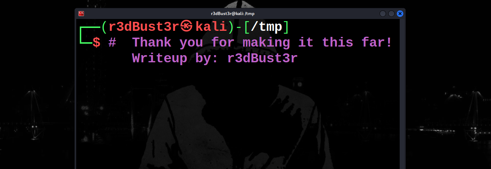  

---

*Thanks for making it this far!*  
**@r3dBust3r**  
