<h1>The Plaga</h1>

<div style="display: flex; align-items: center;">
    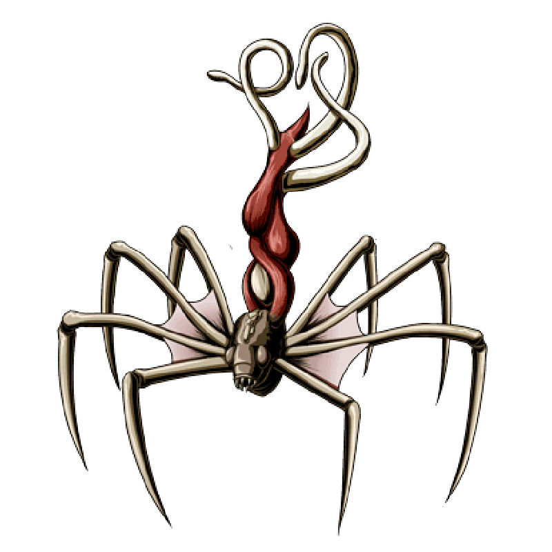
    <p style="width: 75%; font-size: 17px">
    Uncover the hidden secrets of Umbrella Corporation.<br>Can you survive the nightmare and capture all the flags before the infection spreads?<br>Remember, true power lurks in the shadows.
    </p>
</div>

---

## Enumeration
I begin port discovery with a quick SYN scan using Nmap.

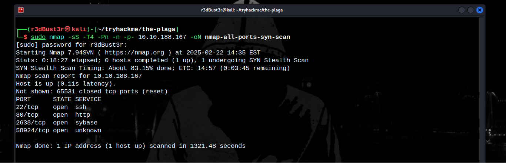

It appears that 4 ports are open. Now, I need to perform a version scan to identify the services running on the target and their versions.

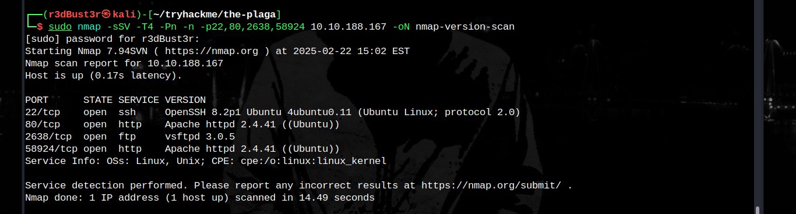

---

### FTP (2638)
Let's attempt to log in to the FTP server using an anonymous account if it's enabled. If we're lucky, we might find something useful.

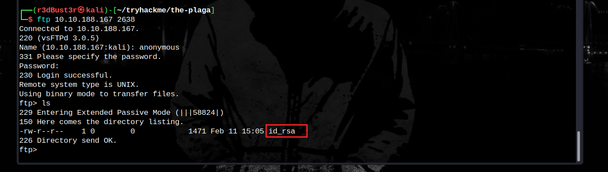

Great! There's an SSH private key. Let's download it to our machine.

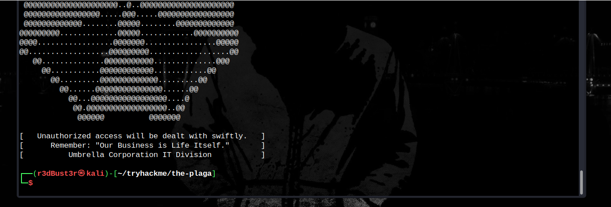

Unfortunately, it's not a real key, just a warning from Umbrella.  
Now, let's enumerate the web service.

---

### HTTP (80)
Let's check what the web server has to offer.

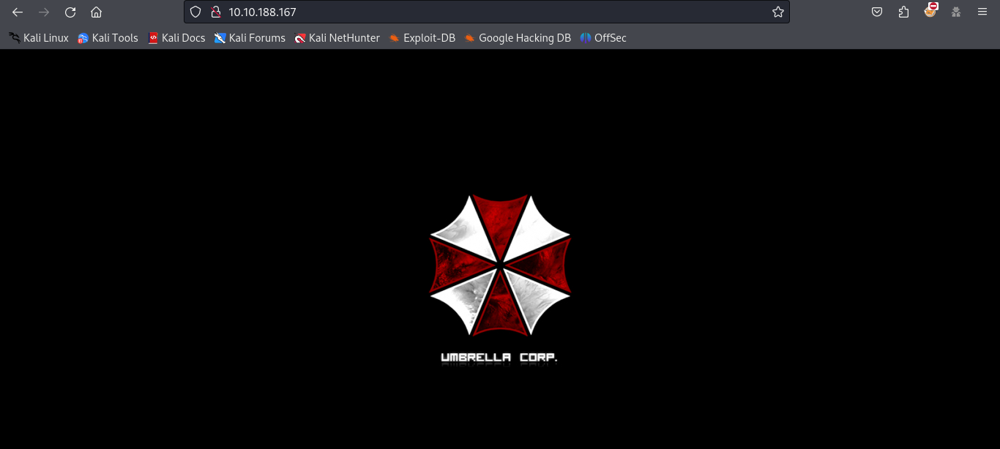

Even the source code doesn't contain anything useful. It's time to run a fuzzing tool. You can choose any tool you prefer:  
- Gobuster  
- Dirb  
- Dirbuster  
- Ffuf  
- Feroxbuster, etc.  

I'm going to use Feroxbuster.

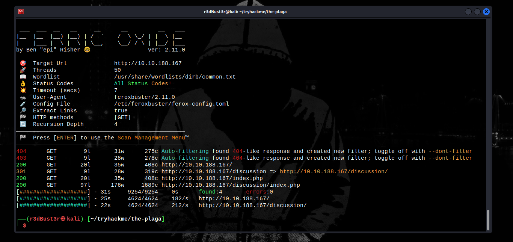

Nice! We found a hidden path to investigate.

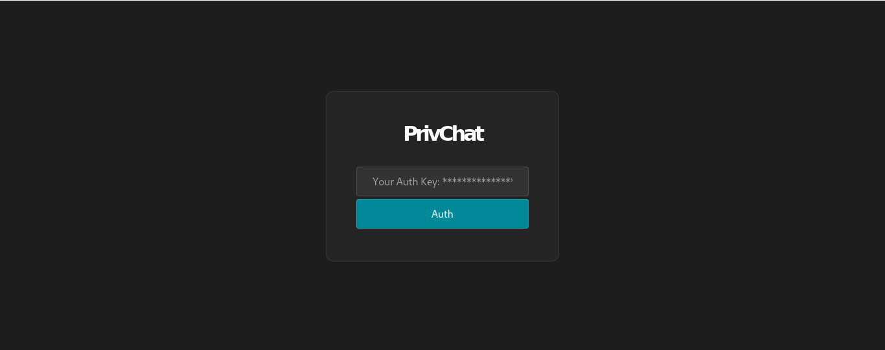

It's an authentication form. Let's see if we can exploit it.

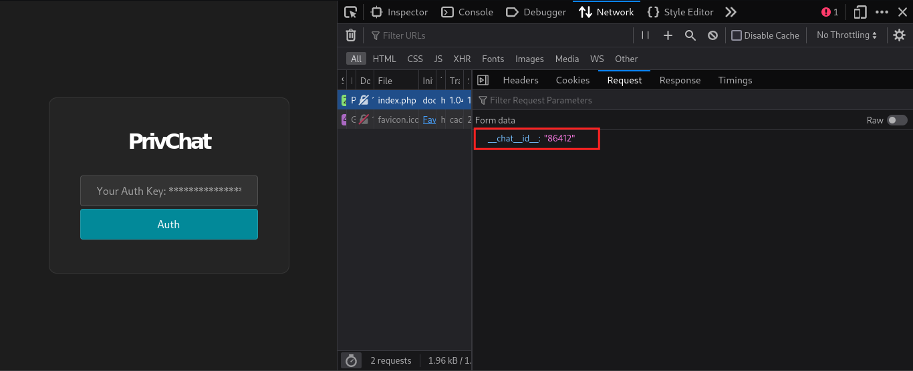

The form sends an HTTP POST request to the server with the `__chat__id__` parameter!<br>
After some investigation, we discovered a comment in the page source:

```html
<!-- 
    Authentication form to access the private chat 
    available on `__privChat__.php`
-->
```

Maybe the form redirects to `__privChat__.php` after a successful login. Let's try accessing this page directly without logging in.

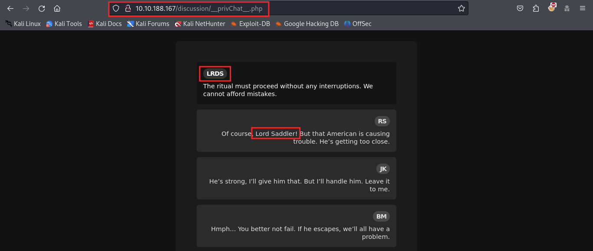

Great! We can access it directly. This is a **broken access control vulnerability**, allowing unauthorized access!  

It seems there's a private chat. Let's collect some usernames from it.

| Nickname | Name         |
|----------|--------------|
| LRDS     | Lord Saddler |
| RS       | ?            |
| JK       | ?            |
| BM       | ?            |

Good for now! Let's see what the other web service has to offer.

---

### HTTP (58924)
The homepage looks similar to the previous one. Time to run another fuzzing  

We found a `robots.txt` file containing:

```
User-agent: *
Disallow: pl4ga004/
Disallow: pl4ga004/plaga_prv_login/
Disallow: restricted_access/
```

Feroxbuster also found an additional endpoint: `/note/`

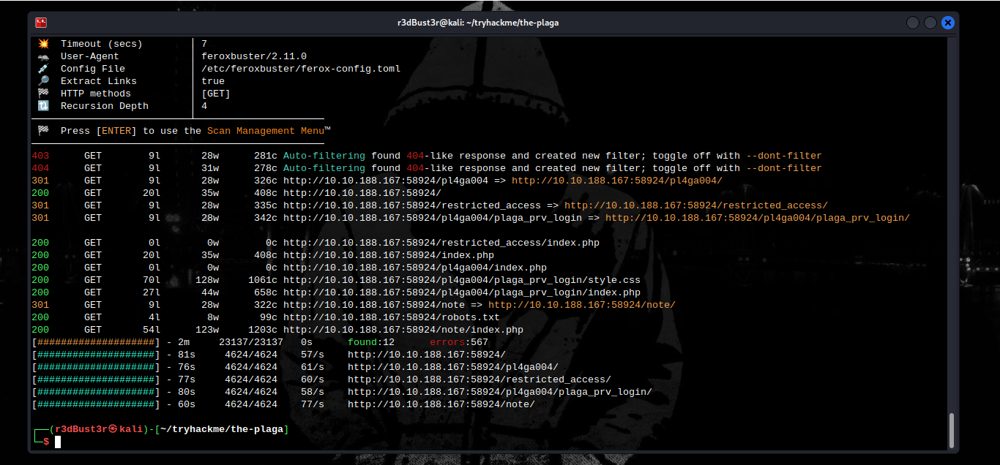

Accessing it only gives us another useless note.

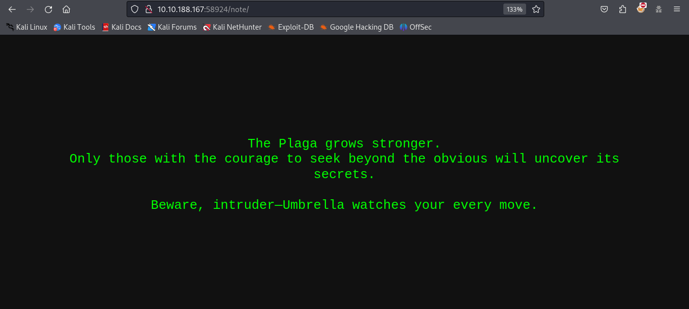

Now, let's investigate the paths found in `robots.txt`.

---

#### `/pl4ga004/plaga_prv_login/`
This path contains a login form.  

- Entering a random username returns: `[ Username not found! ]`
- Trying the name we found earlier, `saddler`, returns: `[ saddler's password is incorrect! ]`

That's interesting. Now we know that a user named **Saddler** exists.  
From the previous chat, we also learned that Saddler's password is weak, but brute-forcing with `rockyou.txt` won’t help.

At this point, we have two options:

- **OPTION #1:** Searching for "Saddler" online, we find that he is a boss character named **Osmund Saddler**. We can generate a custom wordlist based on this information.  
- **OPTION #2:** Fuzzing the login page’s directory for `.bak` files reveals a file named `credentials.bak`.

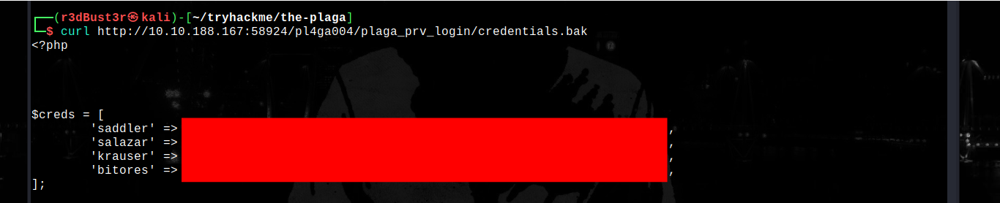

Now that we have password hashes, cracking them should be much easier.

After cracking **Saddler’s** hash and logging in, we discover an upload form named **Plaga Upload**.


The file upload only accepts **JPEG, PNG, and GIF** formats.  
We're hackers, right? Our job is to bypass these restrictions. Let's get to work.

First, I upload a real image.  
I capture the request using **Burp Suite** and manipulate it until I successfully upload a web shell.

  
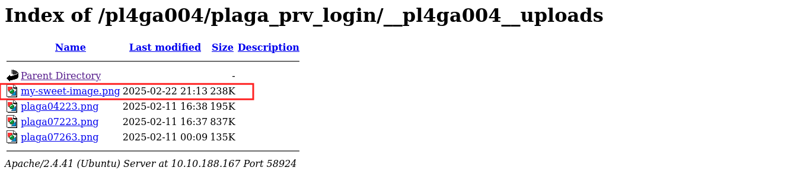  

---

## Gaining Initial Access

After some investigation, we discover that the server filters by MIME type and file signature. But we can bypass these restrictions.

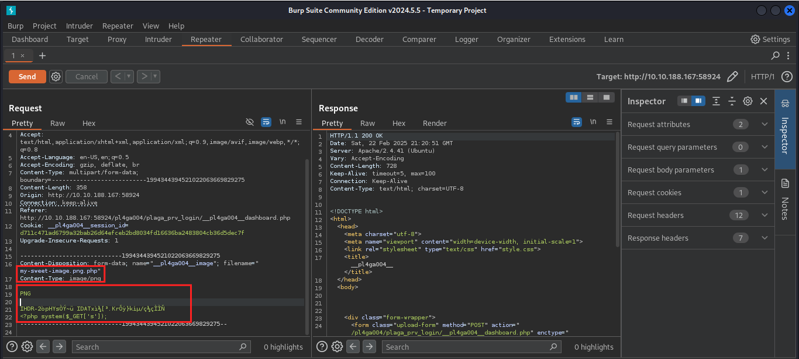

Awesome! Now we can upload a web shell or a reverse shell.

I uploaded a basic web shell with the `s` parameter.

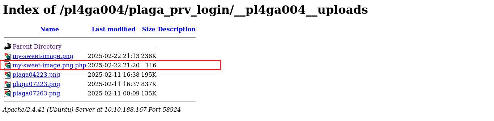  
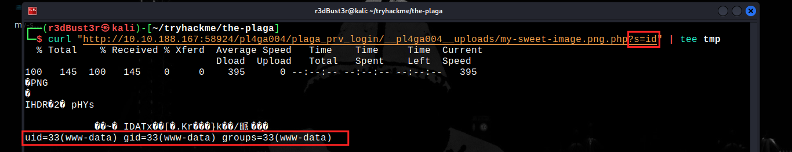  

Now, let's find out who those nicknames belong to!

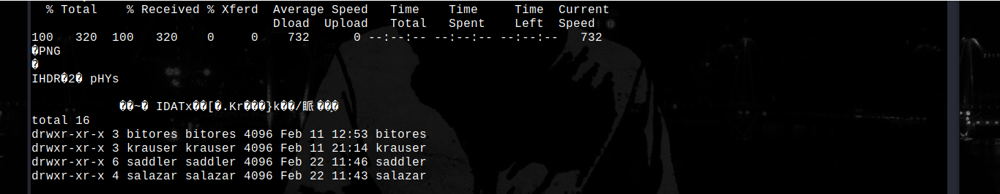  

After some directory enumeration, we find something interesting in **Salazar’s** home directory, his plaintext password stored in `.bash_history`.

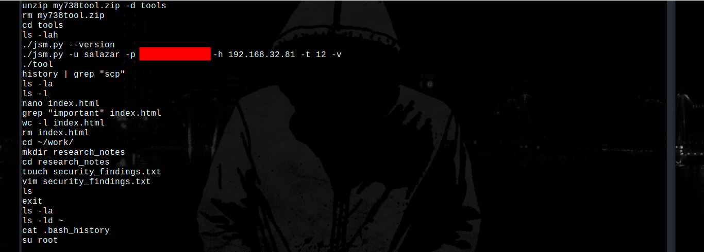  

Maybe it's time to use that **SSH** service.

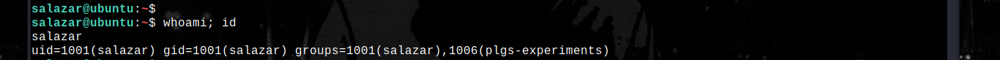  

#### **Salazar’s Flag:**

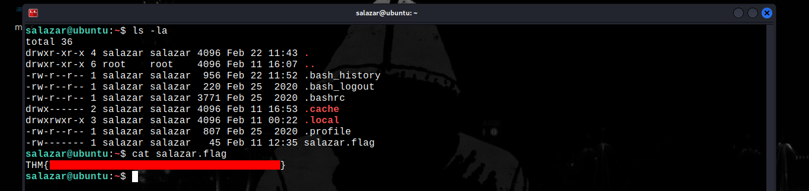  

---

## Privilege Escalation

### **Horizontal PrivEsc**
We don’t find anything useful in **Bitores** and **Krauser’s** home directories,  
but inside **Saddler’s** home, we discover something interesting.

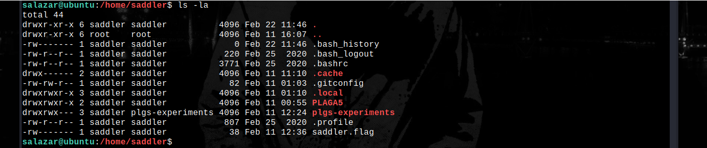  

Let's investigate further.

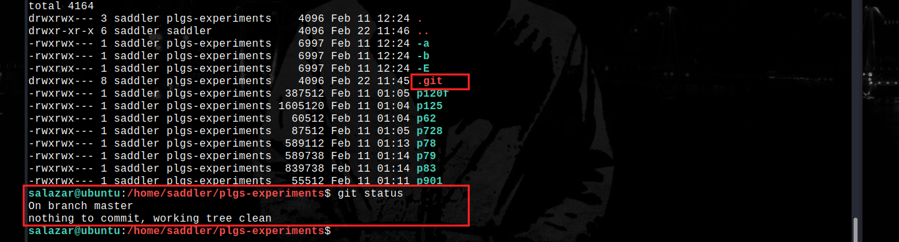  

It appears to be a local **Git** repository. By navigating through its history, we find **Saddler’s** password.

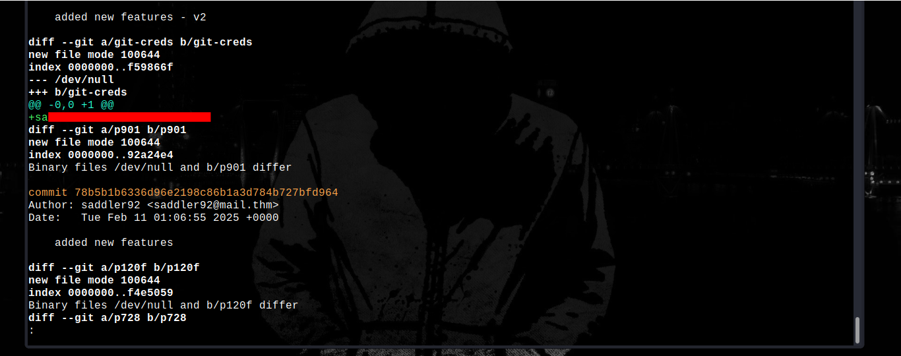  

Time to collect his flag.

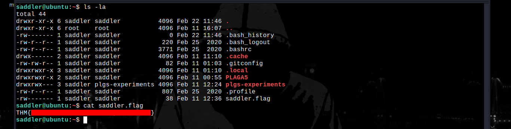  

---

### **Vertical PrivEsc**
Now, let's escalate our privileges to **root**.

We discover an unusual **SUID** binary on the system: `xxd`, with the permissions `-rwsr-x---`. Let's check if we can exploit it.

Running `id` as **Saddler** reveals that he is a member of the **hexers** group. Interesting!  
We have **root** permissions over `xxd`.

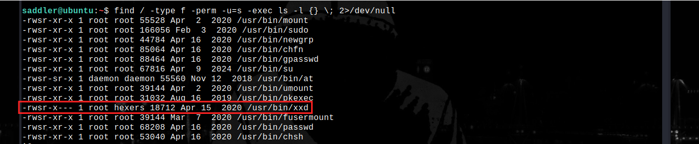  

Time to collect the remaining flags.

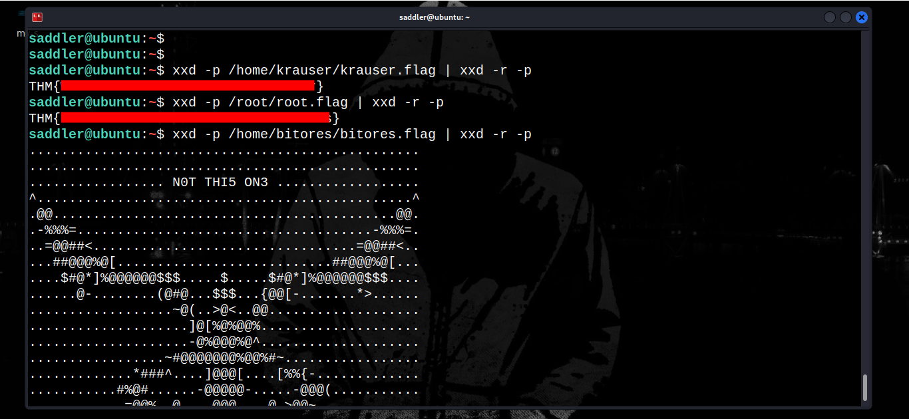  

Only one flag remains: **Bitores’ flag**.  
Can you find it yourself?

#### **Hint: You already have it :)**

<br>...
<br>...
<br>...
<br>...
<br>...
<br>...
<br>...
<br>...
<br>...
<br>...
<br>...
<br>...
<br>...
<br>...
<br>...
<br>...
<br>...
<br>...
<br>...
<br>...
<br>...
<br>...
<br>...
<br>

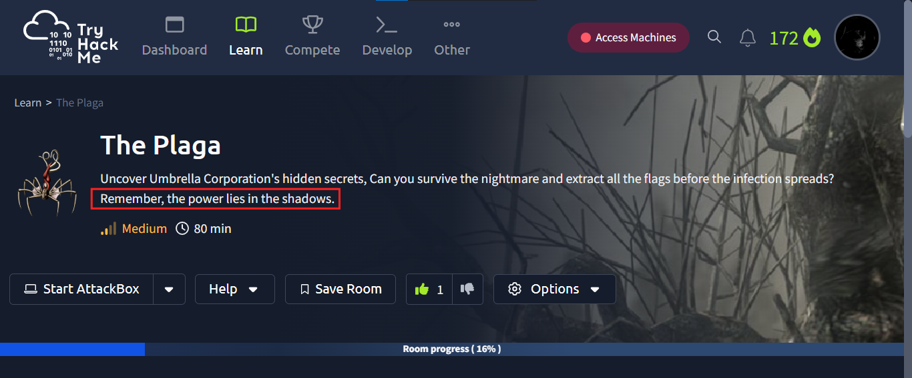  

That's right, The `shadow` file contains the flag.<br>
Let's get it.

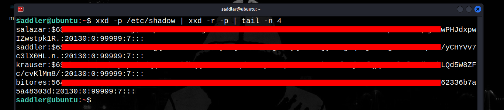  
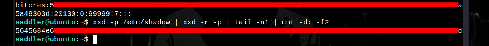  
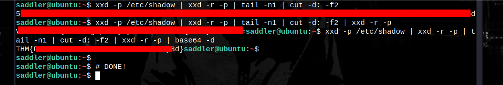  


*Thanks for making it this far!* <br>
**@r3dBust3r**